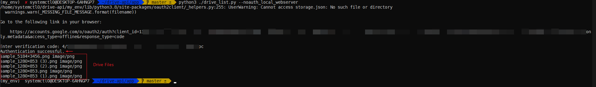

# Drive API POC

<!-- MarkdownTOC autolink="true" -->

- [Clone this repo](#clone-this-repo)
- [References](#references)
- [Creating the GCP Project](#creating-the-gcp-project)
- [Setting up the Python Environment](#setting-up-the-python-environment)
- [Setting UP Credentials and OAuth Screen](#setting-up-credentials-and-oauth-screen)
- [Creating the code](#creating-the-code)
- [Testing](#testing)
- [Troubleshooting](#troubleshooting)
- [CleanUP](#cleanup)

<!-- /MarkdownTOC -->

## Clone this repo

    git clone https://github.com/cronos2810/drive-api.git
    cd drive-api

## References

Guide REF: https://codelabs.developers.google.com/codelabs/gsuite-apis-intro/#4  
API Docs: https://developers.google.com/drive

## Creating the GCP Project

```bash
cd project-creation

terraform init
terraform plan -var-file 00-terraform.tfvars
terraform apply -var-file 00-terraform.tfvars -auto-approve
```

## Setting up the Python Environment 

```bash
# VirtualEnv Installation
cd ..
sudo apt install virtualenv

# Env Creation
virtualenv my_env
virtualenv -p python3 my_env

source my_env/bin/activate

# Install Requirements
cd app
pip install -r requirements.txt

# Confirm Installation
python3 -c "import googleapiclient, httplib2, oauth2client"
```

## Setting UP Credentials and OAuth Screen 

1. Navigate to [console.developers.google.com/start/api?id=drive](http://console.developers.google.com/start/api?id=drive) and login to your Google account.

- Select your project when prompted


- Click "Go to credentials"

2. Choose "Other UI" and "User Data", then click "What credentials do I need?" to move to the following step:


3. Click "Set up consent screen" when prompted, choose your preference and click on "Create", set name and click on Save:

**Name:** Drive API Demo

- Once created, move to the next step.

4. Return to the "Add credentials to your project" screen and set up the credentials with the **same name as your OAuth Consent Screen,** remember to download the **"client_id.json"** file when prompted.

## Creating the code

Back in our "app" folder we need to move the **client_id.json** file here for this to work, then we can use our python file with the following content:

```python
# drive_list.py
from __future__ import print_function

from googleapiclient import discovery
from httplib2 import http
from oauth2client import file, client, tools

scopes = 'https://www.googleapis.com/auth/drive.readonly.metadata'
store = file.storage('storage.json')
creds = store.get()
if not creds or creds.invalid:
    flow = client.flow_from_clientsecrets('client_id.json', scopes)
    creds = tools.run_flow(flow, store)
drive = discovery.build('drive', 'v3', http=creds.authorize(http()))

files = drive.files().list().execute().get('files', [])
for f in files:
    print(f['name'], f['mimetype'])
```


## Testing

We can run the app with:

    python3 ./drive_list.py

- This will authenticate the app trough the browser, Allow all.

Or if you have the browser in a different machine you can use: 

    python3 ./drive_list.py --noauth_local_webserver

Enter the code when prompted:


**Congratulations!!**




## Troubleshooting

- If you have the following error when executing the code:


- Try to download the credentials file again, rename it to "client_id.json" if needed, and remember to copy/replace the file in the app folder (same folder as drive_list.py)
- Make sure that your OAuth 2.0 Client IDs Credential has the same name as your OAuth consent screen:


## CleanUP

To teardown the project and cleanup run:

```bash
cd ../project-creation
terraform destroy -var-file 00-terraform.tfvars -auto-approve
```


